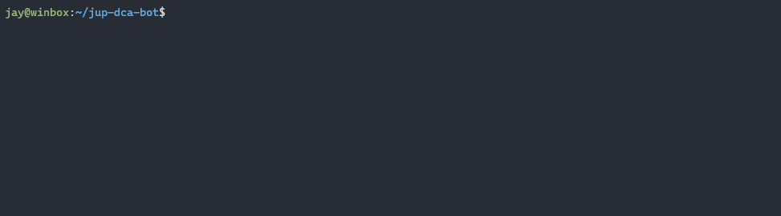

# Jup V3 DCA Bot 
This bot runs a simple dollar cost averaging strategy to buy assets over a period of time. It utilizes [Jupiter Aggregator](https://jup.ag), a swap aggregator on Solana.

This code was adapted from ARBProtocol's jup-dca-bot and has been updated to experiment and learn. It has not been thoroughly tested and is unaudited. Please use at your own risk!

It is best practice **not to store tokens** on the wallet used with this bot apart from what is needed for swapping. Setting up a schedule to move tokens (not needed on the wallet) to a cold-storage hardware backed wallet (aka Ledger wallet) should be implemented to secure the DCA tokens being collected.

Based on the [ARB Protocol DCA Bot](https://github.com/ARBProtocol/jup-dca-bot)



## Install
```
yarn install
```
## Configure
1. Create an `.env` file at the project root. See `.env-example`. 
Private key can be obtained from Phantom via Settings -> Export Private Key.
2. Create your own `dcaconfig.ts`. See `dcaconfig-example.ts` for a template. 

To see example cron expressions, check out [crontab.guru](https://crontab.guru/).
Note: the minimum interval is one minute.
## Run
```
yarn start
```
## Improvements
- transaction retries. Not great to fail on swaps that may occur once-a-week or biweekly.
- start and end dates.
- Log to remote database for tracking
- Auto enable / diable and adjustments for timing & amounts based on custom trading approach ruleset(s)
